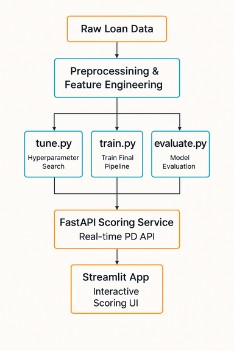

# Credit Risk PD Model
A production-style machine learning system for predicting probability of default (PD) and serving real-time credit risk scores.

## 📌 Overview

This project demonstrates how to build and deploy a full end-to-end ML system, including:

- Data preprocessing & feature engineering
- Model tuning, training, and evaluation
- A FastAPI service for real-time PD scoring
- A Streamlit UI for interactive exploration
- CI/CD automation with tests, linting, model training, evaluation, and Docker builds
- Production-ready Python tooling (uv, ruff, pre-commit)

It is intentionally designed to mirror real-world credit risk modeling pipelines used in fintech and lending platforms.

## 🧠 Problem

Financial institutions need to estimate the probability that a borrower will default on a loan.
Accurate PD estimation is critical for:

- Underwriting
- Pricing
- Credit line management
- Portfolio risk monitoring
- Regulatory compliance (e.g., Basel II/III)

This project builds a robust PD model and exposes it via API so downstream systems (underwriting, demos, dashboards) can consume real-time scores.

## 🔧 Technical Highlights

- Machine learning

  - XGBoost classifier optimized via hyperparameter search
  - Time-based train/validation split to avoid temporal leakage
  - Feature engineering for credit risk (DTI, LTV-like ratios, grade encodings, etc.)
  - Evaluation with ROC-AUC, PR-AUC, Brier Score, calibration curve

- Modern Python workflow
  - uv for environment and dependency management
  - ruff + pre-commit for formatting, linting & style quality
  - Strong modular architecture under src/

- Service layer
  - FastAPI endpoint: /predict
  - JSON schema for loan applications via Pydantic
  - Dockerized for deployment
  - Streamlit demo UI for showcasing predictions

- Automated CI/CD
  - Runs on GitHub Actions
  - tune → train → evaluate sequence executed automatically
  - Model performance artifacts uploaded per build
  - Performance gate: pipeline fails if ROC-AUC falls below threshold
  - Builds Docker images and tags by commit SHA + latest

## 🧩 System Architecture

<!-- markdownlint-disable MD033 -->
  <picture>
  <source media="(prefers-color-scheme: dark)" srcset="docs/system_architecture_dark.png">
  <source media="(prefers-color-scheme: light)" srcset="docs/system_architecture_light.png">
  
</picture>
<!-- markdownlint-enable MD033 -->

## 🧪 Model Workflow Summary

The full ML lifecycle is run both locally and in CI:

1. Hyperparameter Tuning

    ```bash
    uv run python -m src.models.tune
    ```

    Searches over XGBoost params using a time-based validation split and writes:

    - models/metadata/hparam_search_results.json
    - models/metadata/best_params.json

2. Training

    ```bash
    uv run python -m src.models.train
    ```

    - Loads best params (fallback: defaults)
    - Fits final model on older vintages
    - Saves the trained model and metadata

3. Evaluation

  ```bash
  uv run python -m src.models.evaluate
  ```

  Key endpoint:
  POST /predict

  Request body (Pydantic schema: LoanApplication):

  ```json
  {
    "loan_amnt": 10000,
    "annual_inc": 85000,
    "term": "36 months",
    "home_ownership": "RENT",
    "grade": "B",
    "sub_grade": "B3",
    "dti": 18.2
  }
  ```

  Response:

  ```json
  {
    "pd": 0.0641
  }
  ```

## 🎛 Demo UI (Streamlit)

```bash
uv run streamlit run src/app/app.py
```

Interactive demo for scoring sample loans with sliders, dropdowns, and real-time PD predictions.

## 🔄 Continuous Integration (CI)

GitHub Actions automatically runs:

1. pre-commit, ruff, pytest, coverage
2. tune.py → train.py → evaluate.py
3. Uploads:
    - metrics
    - ROC / PR / calibration plots

4. Enforces a minimum ROC-AUC threshold.

5. Builds Docker image with:
    - latest
    - ${GITHUB_SHA} tags

This mirrors the internal pipelines used in production ML teams.

## 📁 Repository Structure

```powershell
src/
  api/            FastAPI scoring service
  app/            Streamlit demo
  data/           Data preprocessing or synthetic generation
  features/       Feature engineering
  models/         tune / train / evaluate
tests/            Pytest suite
docker/           Dockerfile and config
```

Clean, modular, production-style.

## 📚 Further Documentation (Wiki)

To keep the README focused, deeper technical material lives in the Repository Wiki:

- Model Architecture & Data Flow
- Training & Evaluation Design
- Hyperparameter Search Details
- API Contracts & Payload Schemas
- CI/CD Pipeline Deep Dive
- Feature Engineering Specification
- Deployment (Lambda/ECS) Guide

## 🙋‍♂️ About This Project

Designed as a portfolio-grade example of:

- ML system design
- Production engineering practices
- Automated, reproducible pipelines
- Real-time model serving
- Clear separation of concerns across the ML lifecycle

Perfect for demonstrating full-stack machine learning engineering capabilities.

## 📄 License

MIT License - Copyright (c) 2025 Mark Harris

See [LICENSE](LICENSE) file for details.
